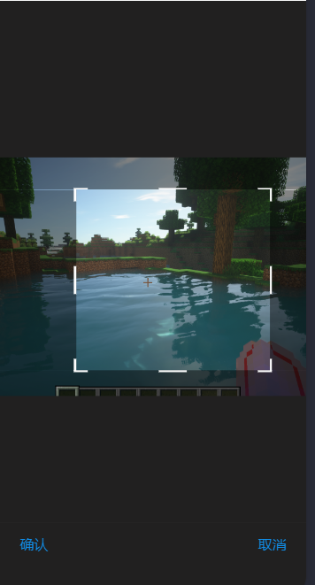

# 效果


# 使用

## 引入组件
```json
  "usingComponents": {
    "image-cropper":"/image-cropper/image-cropper"
  },
  "allowsBounceVertical":"NO" //记得将页面拖动设置为NO
```
在编辑器详情，小程序配置中勾上启用component2。
## page.axml

``` html
<image-cropper a:if="{{true}}}" imgSrc="{{src}}" ref="imagecropper" id="image-cropper" limit_move="{{true}}" disable_rotate="{{true}}" width="{{width}}" height="{{height}}" onLoadimage="loadimage" onConfirm="handleCut" onCancle="handleCancle"></image-cropper>
```

注意 src路径参考 [getimageinfo](https://opendocs.alipay.com/mini/api/media/image/my.getimageinfo)的路径，绝对路径无效，支持网络地址、[本地临时文件](https://opendocs.alipay.com/mini/03dt4s#%E6%9C%AC%E5%9C%B0%E4%B8%B4%E6%97%B6%E6%96%87%E4%BB%B6)、[本地缓存文件](https://opendocs.alipay.com/mini/03dt4s#%E6%9C%AC%E5%9C%B0%E7%BC%93%E5%AD%98%E6%96%87%E4%BB%B6)、[本地用户文件](https://opendocs.alipay.com/mini/03dt4s#%E6%9C%AC%E5%9C%B0%E7%94%A8%E6%88%B7%E6%96%87%E4%BB%B6)、[代码包文件](https://opendocs.alipay.com/mini/03dt4s#%E4%BB%A3%E7%A0%81%E5%8C%85%E6%96%87%E4%BB%B6)。
也可以使用相对路径，需在 mini.project.json 中配置可读取的小程序文件,`src="image/1.jpg"`。
```
// mini.project.json 配置示例，下例中 source 为根目录（app.json 所在目录）下的文件夹，* 代表任意文件名。
{
  "assetsInclude": ["image/*.jpg"]
}
```


## page.js
```js
data{
    src: "" ,
    width: 250, //宽度
    height: 250, //高度
},
imagecropper(ref) {
    this.cropper = ref;
},
//加载图片
loadimage(e) {
    console.log('图片加载完成', e);
    my.hideLoading();
    //重置图片角度、缩放、位置
    this.cropper.imgReset();
  },
//裁剪
handleCut(e){
    console.log("裁剪/确认",e)
},
//取消
handleCancle(){
    console.log("取消")
}
```

### handleCut(e)
返回值e:
```
{
    url: ,//临时文件地址
    width:,//宽度
    height:,//高度
}
```
url的使用参考[文件系统](https://opendocs.alipay.com/mini/03dof7?pathHash=0bf754be)


# 图片裁剪组件配置说明

| 配置项名称       | 类型       | 默认值       | 描述                                                                 |
|------------------|------------|--------------|----------------------------------------------------------------------|
| `onCropperload`  | Function   | null         | 组件加载完成时触发的回调函数。                                      |
| `onLoadimage`    | Function   | null         | 图片加载完成时触发的回调函数。                                      |
| `onConfirm`      | Function   | null         | 用户确认裁剪操作时触发的回调函数。                                  |
| `onCancle`       | Function   | null         | 用户取消裁剪操作时触发的回调函数。                                  |
| `imgSrc`         | String     | ""           | 要裁剪的图片路径。                                                  |
| `height`         | Number     | 200          | 裁剪框的高度。                                                      |
| `width`          | Number     | 200          | 裁剪框的宽度。                                                      |
| `min_width`      | Number     | 64           | 裁剪框的最小宽度。                                                  |
| `min_height`     | Number     | 64           | 裁剪框的最小高度。                                                  |
| `max_width`      | Number     | 300          | 裁剪框的最大宽度。                                                  |
| `max_height`     | Number     | 300          | 裁剪框的最大高度。                                                  |
| `disable_width`  | Boolean    | false        | 是否禁止调整裁剪框的宽度。                                          |
| `disable_height` | Boolean    | false        | 是否禁止调整裁剪框的高度。                                          |
| `disable_ratio`  | Boolean    | false        | 是否锁定裁剪框的比例（宽高比）。                                    |
| `export_scale`   | Number     | 3            | 生成的图片尺寸相对于裁剪框的比例。                                  |
| `quality`        | Number     | 1            | 生成的图片质量（范围为0到1）。                                      |
| `scale`          | Number     | 1            | 图片的缩放比例。                                                    |
| `angle`          | Number     | 0            | 图片的旋转角度。                                                    |
| `min_scale`      | Number     | 0.5          | 图片的最小缩放比例。                                               |
| `max_scale`      | Number     | 2            | 图片的最大缩放比例。                                               |
| `disable_rotate` | Boolean    | false        | 是否禁用图片旋转功能。                                              |
| `limit_move`     | Boolean    | false        | 是否限制裁剪框的移动范围（裁剪框只能在图片内）。                    |

---

## 说明
以上配置项用于自定义图片裁剪组件的行为和外观。开发者可以根据需求调整这些选项以实现特定的功能。

本项目来修改自[image-cropper](https://github.com/1977474741/image-cropper?tab=readme-ov-file),[alipaycrop]https://github.com/YYBT/alipaycrop 由于原组件在使用过程中存在无法导出图片问题，所以进行了修改，并且根据自己的需要添加并修改了部分交互逻辑，如裁剪框横向纵向拖动，确认返回交互等，支付宝端运行良好，微信尚未测试。


